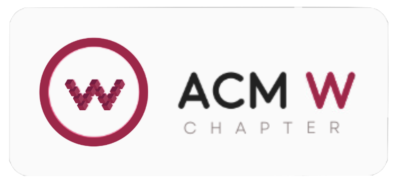

### Hi there 👋

## <h1 align="center">Welcome to ACM-W BPDC</h1>

  

## 
👩‍💻 Empowering Women in Computing 👩‍💼

## About Us

ACM-W BPDC (Association for Computing Machinery - Women in Computing, Birla Institute of Technology, Pilani Dubai Campus) is a local chapter of ACM-W dedicated to supporting, celebrating, and advocating for women in computing. Founded in 2019 by Sabiha Shaik and Akanksha Mathur, our aim is to inspire women in computing by offering programs and services that enhance their skills and broaden their horizons.

## Our Mission

🌟 To empower women in computing by providing services and opportunities for personal and professional growth.

## Our Vision

🚀 To reach out to women from diverse backgrounds and equip them with the tools they need to build strong careers in computing and technology.

## Get Involved

Join our vibrant community of women in computing! Whether you're a student, professional, or enthusiast, there's a place for you in ACM-W BPDC. Here's how you can get involved:

- **Attend Events**: Stay updated with our upcoming workshops, seminars, and networking sessions.
- **Become a Member**: Join ACM-W BPDC to access exclusive resources and opportunities.
- **Volunteer**: Help us organize events and initiatives that support our mission.
- **Contribute**: Share your expertise by presenting at our events or writing for our blog.

## Connect with Us

Stay connected with ACM-W BPDC and be part of our growing community:

- **Website**: [acmwdubai.com](https://acmwdubai.com)
- **GitHub**: [ACM-W BPDC GitHub](https://github.com/acm-w-bpdc)
- **LinkedIn**: [ACM-W BPDC](https://www.linkedin.com/company/acm-w-bpdc)

## Let's Grow Together

Join us in fostering an inclusive and supportive environment for women in computing. Together, we can break barriers and empower the next generation of female technologists! 💪👩‍💻
